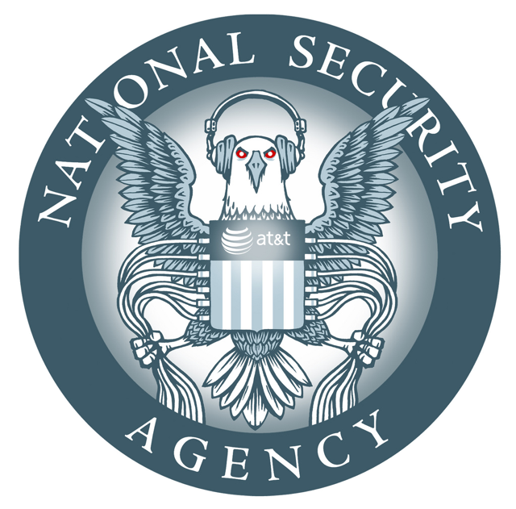
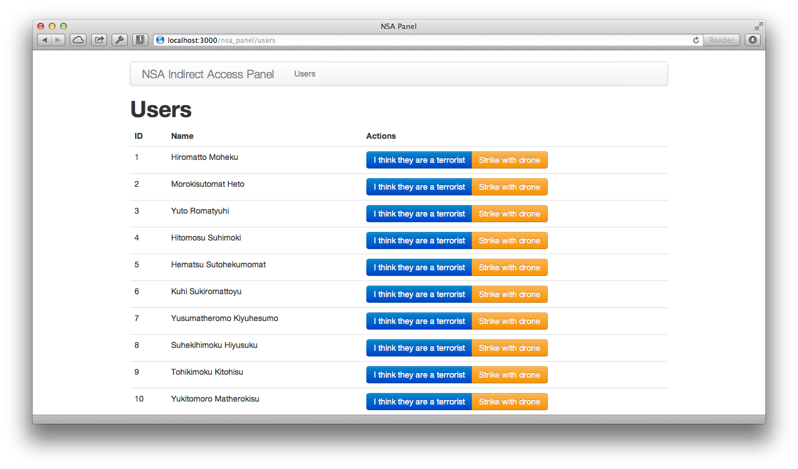
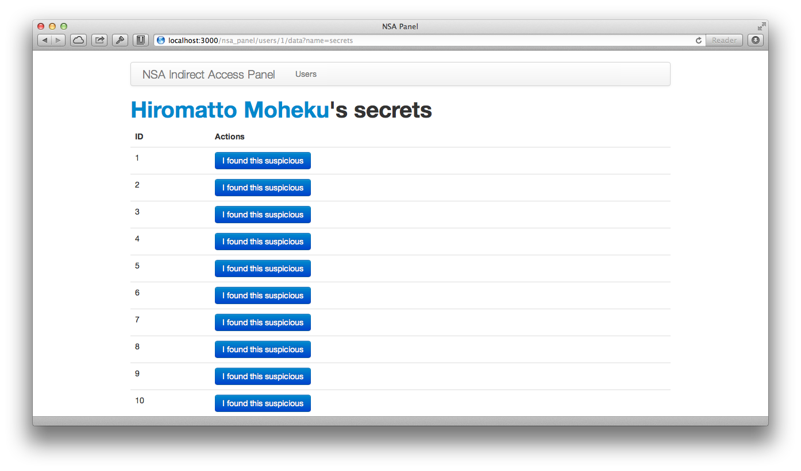
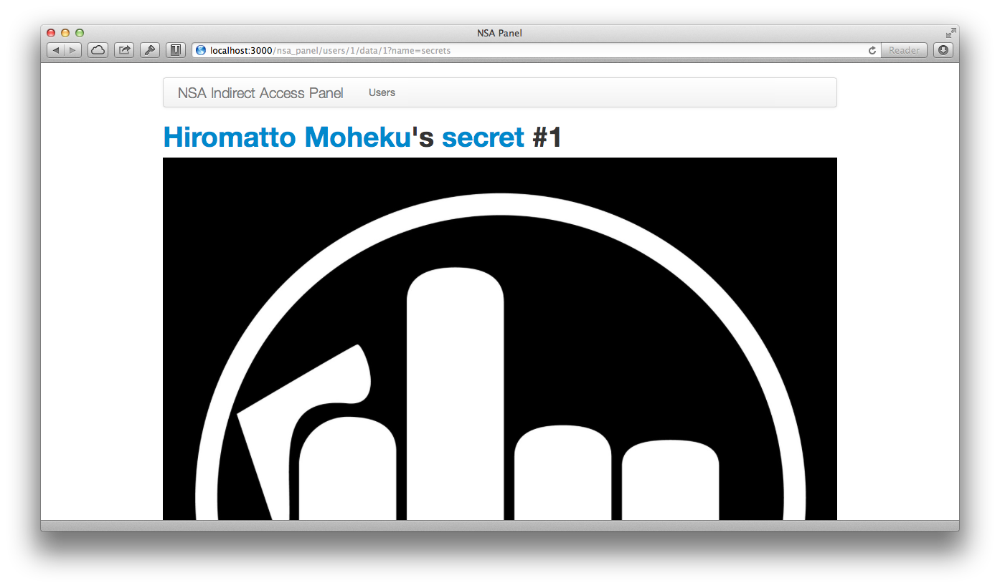

# NSA Panel



The easiest way to add a special panel for NSA agents to monitor your
users' data. Let's ~~destroy the right to privacy~~ fight terrorism together!

Why?

Well, the government wants to protect you and your users from those
crazy guys that blow up everything. Everyone wants to be safe. No liberty
should be superior to the safety and every government is good!

Besides, you and your users really have got **nothing to hide**, haven't you?

## Example

See sample app at `test/dummy`.

1. `bundle install`
2. `rake db:setup`
3. `rails s`
4. visit [localhost:3000/nsa_panel](http://localhost:3000/nsa_panel).
   Use nsa/nsa as credentials.

## Install

Add it to your Gemfile:

```ruby
gem 'nsa_panel'
```

Mount the panel in your routes:

```ruby
# config/routes.rb

mount NsaPanel::Engine => "/nsa_panel"
```

Let it know what's your user class is
(any ORM, must respond to `.all`, `.reflect_on_all_associations`, `#id`, and `#name`):

```ruby
# config/initializers/nsa_panel.rb

NsaPanel.user_class = 'User'
```

Configure panel login/password:

```ruby
# config/initializers/nsa_panel.rb

NsaPanel.username = 'nsa' # ENV['NSA_USERNAME']
NsaPanel.password = 'nsa' # ENV['NSA_PASSWORD']
```

~~Lie~~ Announce the following to your users:

> Dear X users, 

> You may be aware of reports alleging that X and several other Internet
> companies have joined a secret U.S. government program called PRISM to
> give the National Security Agency direct access to our servers. We would
> like to respond to the press reports, and give you the facts. 

> X is not and has never been part of any program to give the US or any
> other government direct access to our servers. We have never received a
> blanket request or court order from any government agency asking for
> information or metadata in bulk, like the one Verizon reportedly
> received. We hadn't even heard of PRISM before yesterday. 

> When governments ask X for data, we review each request carefully to
> make sure they always follow the correct processes and all applicable
> laws, and then only provide the information if is required by law. We
> will continue fighting aggressively to keep your information safe and
> secure. Any suggestion that X is disclosing information about our users’
> Internet activity on such a scale is completely false. 

> We strongly encourage all governments to be much more transparent about
> all programs aimed at keeping the public safe. It's the only way to
> protect everyone's civil liberties and create the safe and free society
> we all want over the long term. We here at X understand that the U.S.
> and other governments need to take action to protect their citizens’
> safety—including sometimes by using surveillance. But the level of
> secrecy around the current legal procedures undermines the freedoms we
> all cherish.

Easy, eh?

## What it looks like









## License

[MIT](MIT-LICENSE).

NSA Eagle Logo credit [EFF](https://www.eff.org/pages/eff-nsa-graphics).
